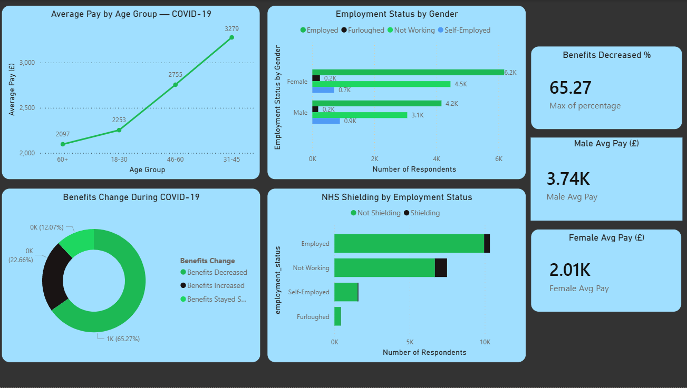
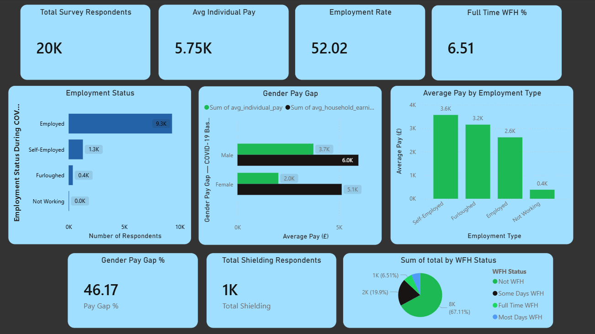

# UK COVID-19 Household Impact Analysis

## Project Overview
Analysis of UK household employment, income and wellbeing during the COVID-19 pandemic using the Understanding Society dataset (UK Data Service).

## Business Questions Answered
- How did COVID-19 impact UK household employment rates?
- Which demographics were financially hit hardest?
- What was the working from home adoption rate?
- How did benefits change during the pandemic?
- What was the relationship between NHS shielding and employment?

## Key Findings
- 52% of respondents were employed during the COVID baseline period
- Only 6.5% of workers were working from home full time
- 46.17% gender pay gap identified — males earning £2,843 vs females £1,560
- 65% of benefit claimants saw their benefits decrease during COVID
- 64% of NHS shielding respondents were not working

## Tools Used
- PostgreSQL — data storage and SQL analysis
- pgAdmin — query execution
- Power BI — interactive dashboard
- Python (Pandas) — data conversion and loading
- UK Data Service — data source

## Dashboard

## Files
- `sql_queries.sql` — all 8 SQL queries used in analysis
- `screenshots/` — Power BI dashboard images

## Dataset
Understanding Society COVID-19 Survey — UK Data Service
20,462 respondents | 2020-2021
